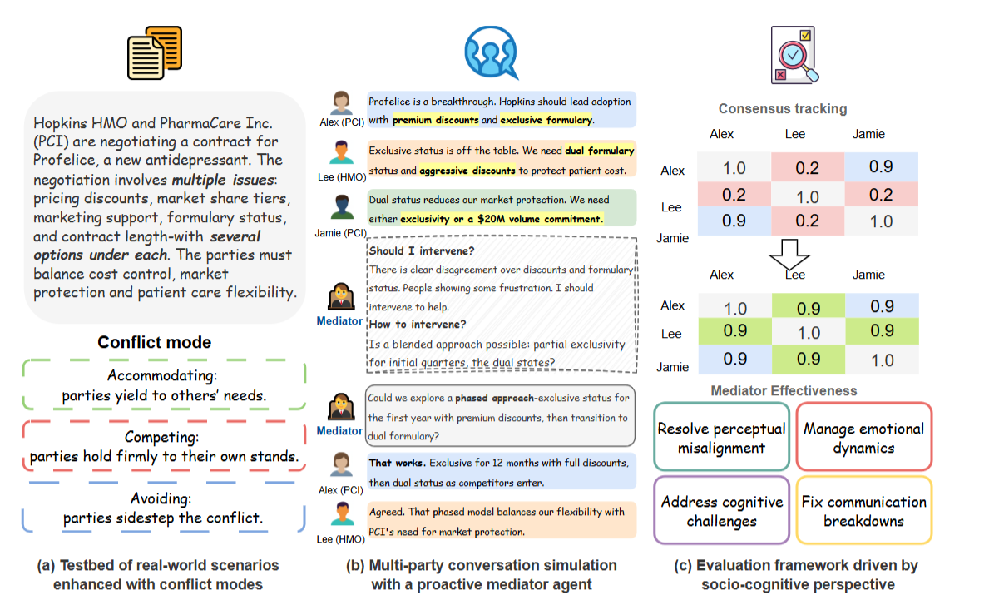

# **ProMediate: Multi-agent negotiation with Proactive Mediator**
[](https://arxiv.org/abs/2510.25224)
---

## Table of Contents
- [Overview](#overview)
- [Installation](#installation)
- [Project Structure](#project-structure)
- [Key Components](#key-components)
- [Usage Examples](#usage-examples)
  - [Basic Example](#basic-example)
  - [Detailed Thought Process Example](#detailed-thought-process-example)
  - [Lecture Practice Example](#lecture-practice-example)
  - [Multi-Party Conversation Example](#multi-party-conversation-example)
- [Citation](#citation)
- [Trademark](#trademark-notice)
- [Contact](#contact)

## Overview
We provide a structured evaluation framework and testbed to evaluate the effectiveness of AI mediator in group negotiation. Different from most work focusing on interaction between agent and individuals, we explore how agent helps in group decision making. 





## Installation

1. Clone the repository:

```bash
git clone https://github.com/....[placeholder]
cd ProMediate
```

2. Install the package and its dependencies:

```bash
pip install -e .
```
### Set up OpenAI API Key

```bash
export OPENAI_API_KEY=your_api_key_here
```
## Project Structure

Our framework includes 3 parts:(1) a **human simulation module** based on the *InnerThought* framework((https://arxiv.org/pdf/2501.00383), published at [CHI 2025](https://doi.org/10.1145/3706598.3713760)), (2) a **plug-and-play mediator agent** that is fully separated from the conversation, and (3) **evaluation metrics** for consensus tracking and mediator intelligence.
1. Testbed scenarios
  All the scenarios used in our experiment are showin in `cases` folder. Each json file contains all the informaiton required to simulate the conversation.

2. Conversation simulation
  - `thoughtful_agents/models/`: Core model classes
  - `participant.py`: Participant, Simulated human, and Mediator class
  - `thought.py`: Thought-related classes
  - `memory.py`: Memory-related classes
  - `conversation.py`: Conversation and Event classes
  - `mental_object.py`: Base class for mental objects
  - `enums.py`: Enumeration types
- `thoughtful_agents/utils/`: Utility functions
  - `llm_api.py`: OpenAI API interaction
  - `saliency.py`: Saliency computation
  - `thinking_engine.py`: Functions for thought generation, evaluation, and articulation
  - `turn_taking_engine.py`: Turn-taking prediction 
  - `text_splitter.py`: Text splitting using spaCy

3. Evaluation
  - `consensus_agreement_pipeline.py`: Attitude detection and agreement score calculation
  - `behavior_evaluation.py`: Mediator intelligence evaluation
  - `visualize_agreement.py`: Visualize consensus over the conversation
  - `evaluation.py`: Get all the metrics


## Example of usage
We provide an example of running experiment in experiment_example.sh. To create a customized scenario and mediator agent, you could follow those steps:

### Prepare Input
- **General Instruction**  
  A shared background context for all participants.

- **Issues**  
  A detailed explanation of each issue, including:
  - The topic
  - Why it matters
  - Any relevant context

- **Options**  
  For each issue, provide several possible options. These do not need to be highly structured or exhaustive.

- **Topics**  
  Extract only the topic from each issue. This is used to track the conversation flow.

- **Configuration for InnerThought Framework**  
  Since the framework uses InnerThought to simulate proactive conversations, a motivation threshold is required.  
  For a simple setup, copy the configuration from the demo file: `hmo.json`.

- **User Prompt**  
  Provide an initial prompt for each participant. This should include:
  - General background
  - Initial opinions on the issues
  - provide strategy

All of this information should be included in a single JSON file.  
Refer to `cases/hmo.json` for an example.

---

### **Customize Mediator**
All mediator models are stored in:  
`thoughtful_agents/models/`

To create a new mediator agent:
1. Import the `Mediator` class:  
   ```from thoughtful_agents.models.participant import Mediator```
   
2. Override the following methods:
``` decide_when()```
```decide_how()```
## Citation

If you use this framework in your research, please cite:

```
@misc{liu2025promediatesociocognitiveframeworkevaluating,
      title={ProMediate: A Socio-cognitive framework for evaluating proactive agents in multi-party negotiation}, 
      author={Ziyi Liu and Bahar Sarrafzadeh and Pei Zhou and Longqi Yang and Jieyu Zhao and Ashish Sharma},
      year={2025},
      eprint={2510.25224},
      archivePrefix={arXiv},
      primaryClass={cs.CL},
      url={https://arxiv.org/abs/2510.25224}, 
}
```
## Trademark Notice

**Trademarks** This project may contain trademarks or logos for projects, products, or services. Authorized use of Microsoft trademarks or logos is subject to and must follow Microsoft’s Trademark & Brand Guidelines. Use of Microsoft trademarks or logos in modified versions of this project must not cause confusion or imply Microsoft sponsorship. Any use of third-party trademarks or logos are subject to those third-party’s policies.

## Contact

For questions or feedback, please feel free to reach out to [Ziyi Liu](https://liuziyi219.github.io/)!
